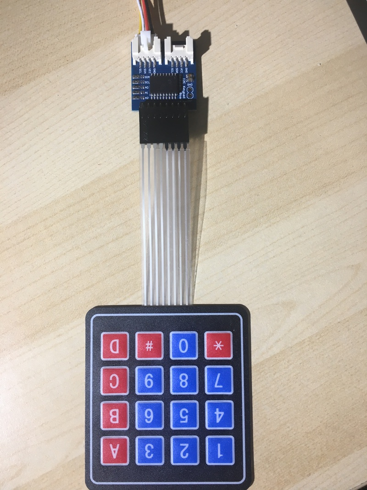

# Dongutec Keypad and Interface (MCP23008)

## What is it?

On AliExpress, I found an [I2C managed keypad and interface](https://www.aliexpress.com/item/32829892555.html)[^1]. That would have been nice - I ask I2C what key is pressed and it tells me. That's not what the hardware was.

It turned out to actually be a I2C accessible GPIO expander, that could be used with a 4x4 matrix key pad to detect keys. But it can also be used for any other purposes you might use GPIO for, assuming you want to access it over I2C.

The MCP23008 is a I2C device that you can give commands to, and it will configure 8 GPIO pins. They can be configured as inputs or outputs. They can be inverted. They can generate interrupts (although the pin isn't wired on this interface. They can have different I2C addresses by soldering across some pads on the board. They have some weak pull up resistors on the lines which can be configured.

The datasheet can be found [here](https://ww1.microchip.com/downloads/en/DeviceDoc/21919e.pdf).

I wanted to drive it from MacOS, so I'm actually driving it through an [MCP2221 USB to I2C interface](https://thepihut.com/products/usb-uart-i2c-debugger) board[^1], with Python. But it can be driven by any I2C library.

## What can you do with it?

Strictly, it's a GPIO expander, so you can do anything that GPIO pins can do - you just have to tell it to do it over I2C. But with the supplied keypad (which is what I was wanting to play with), you can use it to detect key presses.

It takes a few transactions to do so, as you need to detect the row, then the column and combine them, but it's not hard to do.

## What do we have here?

As I could not find any examples of using this device, I had to work out how to do it myself. This repository is the results of that work.

It contains:

* `DongutecKeypadExamples.py` - an example Python program which uses the MCP2221 library to access the I2C, to talk to the MCP23008. If you don't have one of those, then you'll need to switch out the I2C calls for ones that talk to the I2C bus. However, it should otherwise need no significant work.

* `DongutecKeypad,fd1` - an example BBC BASIC program which uses the IIC module on RISC OS to communicate with the MCP23008. The code is a direct translation of the Python, and has been tested on RISC OS Pyromaniac with the MCP2221 providing the I2C interface. However, as the IIC module is present on most RISC OS systems, this should work on any device.

In both cases, you run the program and press keys on the device. The key number will be printed when you press them.

---

[^1]: This is not an endorsement of the product other than this is what I bought, and what I made work.
